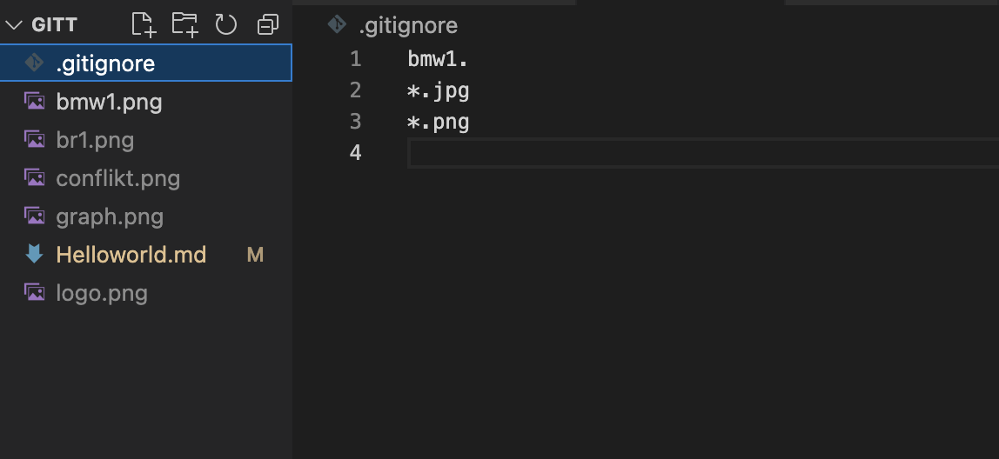

# Работа с Git

## 1. *Проверка наличия установленного Git*
В терминале выпонить команду:
```
 git version
 ```
```Java
while(n <5 )
{
count++
}
```
Если Git установлен появится сообщение с информацией о версии программы:
```
git version 2.33.0
```
иначе появится сообщение об ошибке.

## 2. *Установка Git*

Загружаем последнюю версию Git с сайта https://git-scm.com/downloads

Устанавливаем с настройками по умолчанию.

## 3. *Настройка Git*

При первом использовании Git необходимо представиться. Для этого ввести в терминале 2 комманды
```
git config --global user.name "Имя пользователя"
```
```
git config --global user.email почта@почта.com
```

## 4. *Делаем инициализацию репозитория*

1. В терминале переходим к папке в которой зотим создать репозиторий. Делаем это командой
```
git init
```
2. Клонировать существующий пепозиторий Git из любого места. Сделать можно так:
```
git clone <адрес репозитория>
```
## 5. *Запрашиваем статус*

Для запроса статуса ввести команду:
```
git status
```
## 6. *Добавляем изменения*

Добавим все файлы проекта в нам будующий commit
```
git add 
```
Или так
```
git add --all
```
Если хотим добавить конкретный файл то можно так

```
git add <имя_файла> 

```
## 7. *Фиксируем изменения*

Чтобы зафиксировать изменения нужно ввести команду:
```
git commit -m "какой то комментарий с изменениями"
```
или же ввести команду :
```
git commit -am "комментарий с изменением"`
```
но эту команду можно вводить только если вы работаете с одним файлом иначе все файлы подвергнутся изменениям.
К неотслеживаемым файлам он не применит добавления

## 8. *Журнал изменений* 

Перед переключением версии файла в Git
используйте команду: 
```
git log
```
данная команда перечисляет коммиты с их хэш-кодами, именем и электронной почтой автора. датой создания и сообщением коммита.

или же что бы увидеть все в одной строке 
```
git log --oneline
```
 чтобы увидеть
количество сохранений


## 9. *Команда **GIT CHECKOUT**  Перемещение между коммитами

Для переключение между коммитами используем команду:
```
git checkout "вводим первые 4 символа с журнала изменений версии"
```
Для работы нужно указать не только
интересующий вас коммит, но и вернуться
в тот, где работаем, при помощи команды:
```
git checkout master`
```
## 10. ***Команда GIT DIFF***

чтобы показать разницу между текущим файлом
и сохранённым нужно ввести команду:
```
git diff
```
## 11. ***Запись изменений в репозиторий***

Каждый файл в рабочей папке(репозитории) может находиться в одном из двух состояний: под версионным контролем(отслеживаемым) и нет (неотслеживаемым)

Отслеживаемые файлы могут быть неизмененными измененными или неподготовленными к коммиту.


## 12. ***Добавление картинки***

Чтобы добавить картинку или изображение нужно ввести команду:

``` 

```


## 13. ***Работа с ветками***

1. ***Cоздание новой ветки***

Создать ветку можно командой git branch.
Делать это надо в папке с репозиторием:
```
git branch <название новой ветки>
```


2. ***Просмотр ветки***

Чтобы увидеть в какой ветке мы находимся вводим команду :

```
git branch
```
3. ***Переключение между ветками***

Если потребуется переключиться с одной ветки
на другую, вызовем команду:
```
git checkout <имя
ветки>
```
4. ***Совмещение (слияние) веток***

Чтобы слить любую ветку с текущей, вызываем
команду:
```
git merge <имя ветки для слияния с текущей>
```
5. ***Удаление ветки***

Для того, чтобы удалить ненужную ветку, используйте команду:
```
git branch -d <имя ветки>
```
Если же вы не сохранили изменения в ветке и все равно хотите ее удалить, используйте команду:

```
git branch -D <имя ветки>
```
6. ***Конфликт при слиянии веток***

При работе в двух ветках одновременно может
возникнуть ситуация, когда в одной и другой
ветке мы по-разному изменили блок текста.
Если затем мы попробуем слить эти ветки, Git
сообщит о конфликте и предложит выбрать,
какие же изменения записать.


7. ***Визуализация веток***

Ключ -graph в связке с командой log позволяет отобразить коммиты в виде дерева.

```
git log --graph
```


## 14. ***Игнорирование файлов***

Для того, чтобы наши файлы (изображения ,папки) не отслеживались Git, нужно создать новый  файл с расширением 
```
.gitignore
```
и добавить туда нужные нам файлы либо папки либо изображения
прописав это в самом файле 



## 15. ***Работа с удаленными репозиториями***

Прежде чем работать с удаленными репозитариями Вам необходимо зарегистрироваться на сайте _GitHub_ :  https://github.com/ , где пройдя стандартную регистрацию, Вы сможете создать удаленный репозитарий. Выбрав при этом будет он публичным(общественным), или приватным(вы сами решите кому давать доступ) 
 
 
 
### 11.1 Просмотр удалённых репозиториев
Для того, чтобы просмотреть список настроенных удалённых репозиториев, вы можете запустить команду 
```
git remote
```
Если у вас уже есть удаленный репозитарий то Вы увидите как минимум origin — имя по умолчанию, которое Git даёт серверу, к которому вы привязались.

Вы можете также указать ключ -v, чтобы просмотреть адреса для чтения и записи, привязанные к репозиторию:
```
git remote -v 
```

### 11.2 Добавление удалённых репозиториев
 Для того, чтобы добавить удалённый репозиторий, просто выполните команду
 ```
  git remote add <имя репозитария(по умолчанию origin)> <url>
  ```
  _url_ необходимо взять с GitHub или другого сервера.
### 11.3 Отправка изменений в удаленный репозиторий (Push)
Когда вы хотите поделиться своими наработками, вам необходимо отправить их в удалённый репозиторий. Команда для этого действия простая:
```
 git push <remote-name> <branch-name>
 ```
 ### 11.4 (__PULL__) Извлечения и загрузки содержимого из удаленного репозитория и немедленного обновления локального репозитория этим содержимым.
Команда используется для cлияния удаленных вышестоящих изменений в локальный репозиторий 
```
git pull
``` 

### 11.5 Создание форка репозитория на GitHub. Пулл-реквесты.
Итак, одной из самых важных частей GitHub является создание форков.

1. _Форк (от англ. fork – вилка) – точная копия репозитория, но в вашем аккаунте. Форки нужны, чтобы вносить свои изменения в проект, к репозиторию которого у вас нет прямого доступа._

2. __Пулл-реквест (от англ. pull-request – запрос pull) – функция GitHub, позволяющая попросить владельца репозитория, от которого мы сделали форк, загрузить наши изменения обратно в свой репозиторий.__

* Если коротко, форки и пулл-реквесты нужны, чтобы любой пользователь мог внести свой вклад в любой открытый проект, репозиторий которого есть на GitHub. Кроме того, перед тем как влить ваши изменения в основной репозиторий, ответственные обязательно проверят ваш код на наличие ошибок и уязвимостей. Таким образом, даже если ваши изменения не примут, вы получите первоклассный code-review с указанием всех неточностей.

#### 1. Для начала зайдем на страницу репозитория проекта. Нажимаем на кнопку Fork, как показано на картинке. После этого Git создаст точную копию этого репозитория в вашем аккаунте.

#### 2. Клонируем репозиторий к себе на компьютер командой 
```
git clone <URL удаленного репозитория>
```

#### 3. 
* ___Предварительно необходимо создать новую ветку, так как работать и изменять основную ветку не принято в мире программистов!___
* Проводим работу, изменения, делаем коммиты
* Затем выполним ```git push```, чтобы загрузить наши изменения в удаленный репозиторий.

#### 4. Скорее всего Git не сможет выполнить данную команду так как такой ветки не откажется на удаленном репозитории и предложит Вам выполнить следующую:
```
git push --set-upstream origin <имя новой ветки в которой Вы делали изменения>
```
#### 5. После чего вам нужно вернуться на сайт GitHub, где в вашем репозитории должна появится зеленая кнопка <span style="color:green">*Compare & pull request*</span>.


## 12. Полезные команды терминала
В ходе работы с Git будут так же полезны терминальные команды 
```
ls - список папок и файлов.
ls -a показать список скрытых файлов.
cd Имя папки - заход в папку. 
mkdir Имя папки - создаст папку. 
touch Имя файла - создаст файл.
rm имя файла - полное удаление файла без возможности восстановления.
rm -R имя папки - полное удаление папки и все что внутри
```
## 13. Дополнительная информация 
* Всю необходимую информацию Вы можете найти в книге Pro Git, написанную Скоттом Чаконом и Беном Штраубом, она доступна для чтения онлайн бесплатно
https://git-scm.com/book/ru/v2 .
* А так же справочное руководство:
Официальные и всеобъемлющие справочные страницы, которые включены в сам пакет Git. https://git-scm.com/docs

## 14. **Добавление нового репозитория в качестве поддерева**
Добавьте новый удаленный URL-адрес, указывающий на отдельный интересующий нас проект.

```
git remote add -f spoon-knife https://github.com/octocat/Spoon-Knife.git
> Updating spoon-knife
> warning: no common commits
> remote: Counting objects: 1732, done.
> remote: Compressing objects: 100% (750/750), done.
> remote: Total 1732 (delta 1086), reused 1558 (delta 967)
> Receiving objects: 100% (1732/1732), 528.19 KiB | 621 KiB/s, done.
> Resolving deltas: 100% (1086/1086), done.
> From https://github.com/octocat/Spoon-Knife
>  * [new branch]      main     -> Spoon-Knife/main
```
Объедините Spoon-Knifeпроект с локальным проектом Git. Это не изменит ни один из ваших файлов локально, но подготовит Git к следующему шагу.

Если вы используете Git 2.9 или выше:

```
git merge -s ours --no-commit --allow-unrelated-histories spoon-knife/main
> Automatic merge went well; stopped before committing as requested
```
Если вы используете Git 2.8 или ниже:
```
git merge -s ours --no-commit spoon-knife/main
> Automatic merge went well; stopped before committing as requested
```
Создайте новый каталог с именем Spoon-knife и скопируйте в него историю Git Spoon-Knifeпроекта.

```
git read-tree --prefix=spoon-knife/ -u spoon-knife/main
```
Зафиксируйте изменения, чтобы сохранить их в безопасности.

```
git commit -m "Subtree merged in spoon-knife"
> [main fe0ca25] Subtree merged in spoon-knife
```